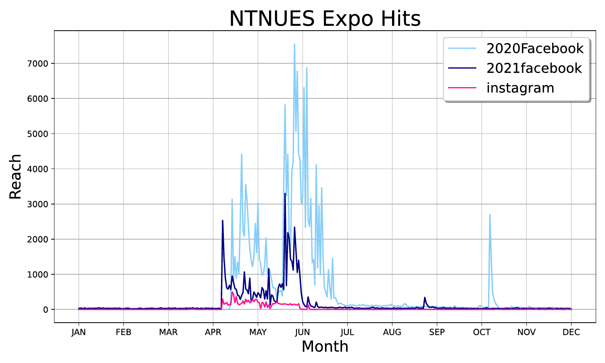

# 2021 Geoscience Expo Data Analysis

This is a final project for the Data Processing course at NTNU's Department of Earth Sciences. It analyzes Facebook insights data from the 2021 Geoscience Expo to evaluate audience engagement and promotion effectiveness.

## 🔍 Goals

- Regional interest distribution across Taiwan  
- Age and gender demographics of viewers  
- Engagement trends over time  
- Correlation between post shares and reach  

## 📊 Tools

- Python (`pandas`, `matplotlib`, `numpy`, `obspy`)  
- GMT for map visualization  
- Data from Facebook Insights (CSV)

## 📈 Highlights

- Strongest interest from Taipei area  
- Audience mostly students  
- Facebook reach declined in 2021  
- Share count strongly correlated with reach (R ≈ 0.86)

## 📌 Tip

Boost post sharing for better outreach in future events.
